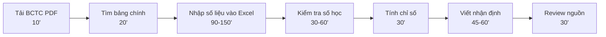
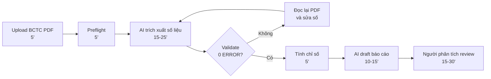

# Workflow — Phân tích BCTC từ PDF

## Current State

| Bước | Ai làm | Thời gian | Output | Ghi chú |
|---|---|---:|---|---|
| 1. Tải BCTC PDF | Researcher | 10' | Bộ PDF theo năm | Cần lấy đúng nguồn |
| 2. Tìm bảng chính | Researcher | 20' | Trang BCĐKT/KQKD/LCTT | Dễ nhầm trang/đơn vị |
| 3. Nhập số liệu | Researcher | 90-150' | Excel/raw table | **Bottleneck chính** |
| 4. Kiểm tra số học | Researcher | 30-60' | Bảng đã kiểm tra | Sai thì quay lại PDF |
| 5. Tính chỉ số | Researcher | 30' | Bộ chỉ số | Công thức phải nhất quán |
| 6. Viết nhận định | Researcher | 45-60' | Draft báo cáo | Cần có số đi kèm |
| 7. Review nguồn | Reviewer | 30' | Bản đã soát | Kiểm trước khi dùng |

**Tổng thời gian:** khoảng **3-5 giờ/doanh nghiệp**.

**Điểm nghẽn:** nhập và đối chiếu số liệu từ PDF sang bảng dữ liệu.

---

## Future State

| Bước | Ai làm | Thời gian | Output | Ghi chú |
|---|---|---:|---|---|
| 1. Upload/tải PDF | Người dùng | 5' | Bộ PDF đầu vào | Ưu tiên nguồn chính thức |
| 2. Preflight | Rule/script | 5' | Năm, trang, đơn vị | Kiểm tra trước khi đọc số |
| 3. Trích xuất số liệu | AI hỗ trợ | 15-25' | Raw data có nguồn | Không tự tin thì đánh dấu |
| 4. Validate | Script | 5-10' | Validation report | **Machine gate** |
| 5. Tính chỉ số | Script | 5' | Ratios/trends | Công thức cố định |
| 6. Draft báo cáo | AI hỗ trợ | 10-15' | Bản nháp có trích dẫn | Không tự kết luận đầu tư |
| 7. Review | Người phân tích | 15-30' | Bản dùng nội bộ | **Human boundary** |

**Tổng thời gian kỳ vọng:** khoảng **45-75 phút/doanh nghiệp**.

**Fallback:** nếu validate lỗi hoặc số đọc không chắc, quay lại PDF gốc để sửa. Nếu vẫn không chắc, giữ báo cáo ở trạng thái bản nháp.

---

## Before / After

| Metric | Trước | Sau kỳ vọng |
|---|---:|---:|
| Tổng thời gian | 3-5 giờ | 45-75 phút |
| Số bước | 7 | 7 |
| Số bước thủ công | 7/7 | 2-3/7 |
| Bottleneck | Nhập số liệu PDF | Review số chưa chắc |
| Risk chính | Lỗi nhập tay | AI/OCR đọc sai |

## Boundary

| AI / Script được làm | Người thật vẫn phải làm |
|---|---|
| AI hỗ trợ trích xuất số liệu từ PDF | Kiểm tra số trọng yếu với PDF gốc |
| Script validate số học và tính chỉ số | Quyết định báo cáo có đủ tin cậy để dùng không |
| AI draft phần nhận định có trích dẫn | Sửa diễn giải, giữ/gỡ trạng thái bản nháp |
